# GitUnderstand System Design

> **Domain:** `gitunderstand.com`
> **Cloud:** Google Cloud Platform (GCP) | **Region:** `us-central1`
> **Project ID:** `gitunderstand`

---

## Table of Contents

1. [Architecture Overview](#architecture-overview)
2. [Service Architecture](#service-architecture)
3. [Request Flow Diagrams](#request-flow-diagrams)
4. [Data Model](#data-model)
5. [Storage Architecture](#storage-architecture)
6. [Authentication & Security](#authentication--security)
7. [AI Integration (BYOK)](#ai-integration-byok)
8. [GCP Infrastructure](#gcp-infrastructure)
9. [Deployment Pipeline](#deployment-pipeline)
10. [Cost Estimates](#cost-estimates)

---

## Architecture Overview

GitUnderstand is a three-service architecture that converts Git repositories into LLM-friendly text digests and interactive visualizations.

```
                            gitunderstand.com
                                  |
                    +-------------+-------------+
                    |   Cloud Run: Next.js      |
                    |   (gitunderstand-web)      |
                    |       port 8080            |
                    +---+-------------------+---+
                        |                   |
               /api/* proxy          Direct client calls
               (except /api/auth)    (from browser)
                        |                   |
          +-------------+------+    +-------+-----------+
          | Cloud Run: FastAPI |    | Cloud Run: FastAPI |
          | (gitunderstand)    |    | (gitdiagram-backend)|
          |     port 8080      |    |     port 8000      |
          +--------+-----------+    +-------+-----------+
                   |                        |
                   |                +-------+-----------+
                   |                | Cloud SQL         |
          +--------+-----------+    | (PostgreSQL 15)   |
          | GCS Bucket         |    | gitdiagram-db     |
          | gitunderstand-     |    +-------------------+
          | digests            |
          +--------------------+
```

### High-Level Mermaid Diagram

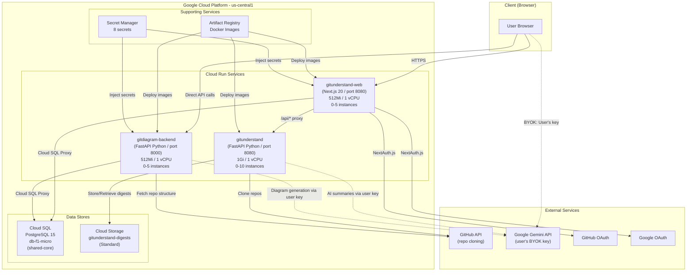

---

## Service Architecture

### 1. Frontend: `gitunderstand-web` (Next.js)

**Purpose:** Unified web frontend serving the landing page, repo analysis results, diagrams, and AI features.

| Property | Value |
|----------|-------|
| Framework | Next.js 20 (standalone output) |
| Runtime | Node.js 20 Alpine |
| Port | 8080 |
| Memory | 512 Mi |
| CPU | 1 vCPU |
| Instances | 0-5 (scales to zero) |

**Key Responsibilities:**
- Landing page with repo URL input form
- Repo results page (wiki-style sidebar with tabs)
- Code Explorer with file tree and content viewer
- Interactive diagram rendering (Mermaid)
- AI summary display and streaming
- Chat interface for AI conversations
- Authentication (NextAuth.js v5 with GitHub + Google OAuth)
- API key management (encrypted storage in PostgreSQL)
- Proxies `/api/*` requests to GitUnderstand backend

**Routing / Proxy Configuration (next.config.js):**

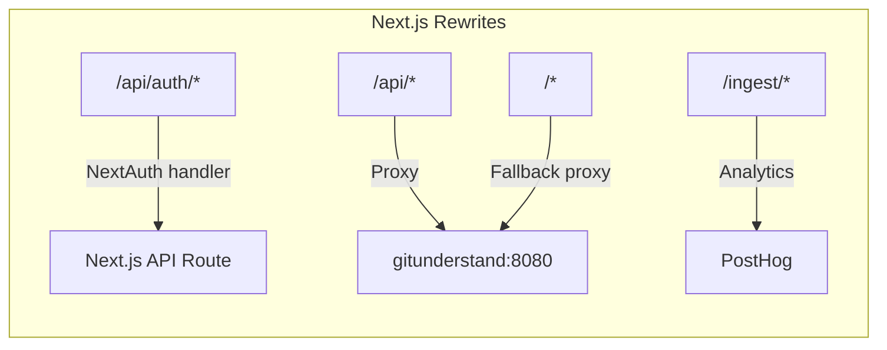

### 2. Ingestion Backend: `gitunderstand` (FastAPI)

**Purpose:** Clones Git repositories, analyzes codebases, generates text digests, and provides AI-powered summaries/chat.

| Property | Value |
|----------|-------|
| Framework | FastAPI (Python 3.13) |
| Port | 8080 |
| Memory | 1 Gi |
| CPU | 1 vCPU |
| Instances | 0-10 (scales to zero) |

**Endpoints:**

| Method | Path | Rate Limit | Description |
|--------|------|------------|-------------|
| `POST` | `/api/ingest` | 10/min | Ingest a repo (JSON response) |
| `POST` | `/api/ingest/stream` | 10/min | Ingest with SSE progress events |
| `GET` | `/api/{user}/{repo}` | 10/min | Ingest via URL path |
| `GET` | `/api/download/file/{id}` | - | Download digest file |
| `GET` | `/api/summary/available` | - | Check if AI is available |
| `POST` | `/api/summary/stream` | 15/min | Stream AI summary (SSE) |
| `POST` | `/api/chat/stream` | 15/min | Stream AI chat response (SSE) |
| `GET` | `/health` | - | Health check |

### 3. Diagram Backend: `gitdiagram-backend` (FastAPI)

**Purpose:** Generates Mermaid diagrams from repository structure using Gemini AI.

| Property | Value |
|----------|-------|
| Framework | FastAPI (Python 3.12) |
| Port | 8000 |
| Memory | 512 Mi |
| CPU | 1 vCPU |
| Instances | 0-5 (scales to zero) |

**Endpoints:**

| Method | Path | Description |
|--------|------|-------------|
| `POST` | `/generate` | Generate diagram for a repo |
| `POST` | `/modify` | Modify an existing diagram |
| `GET` | `/health` | Health check |

---

## Request Flow Diagrams

### Flow 1: User Submits a Repository URL

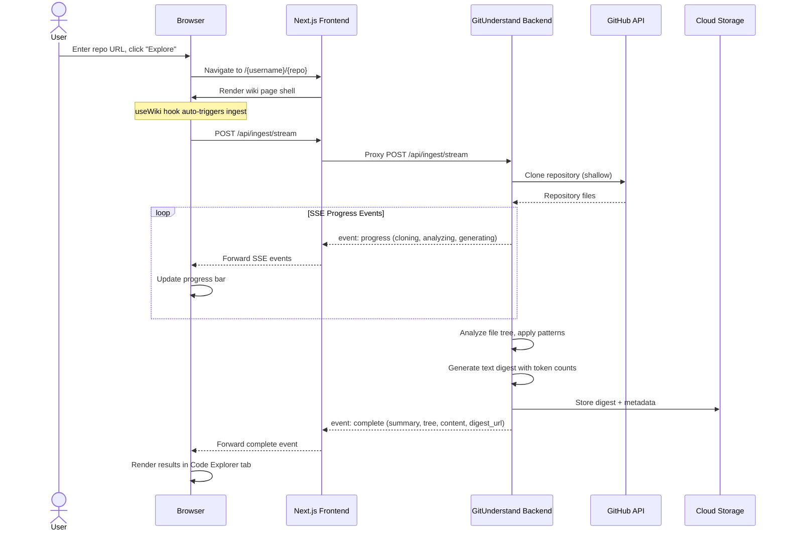

### Flow 2: AI Summary Generation

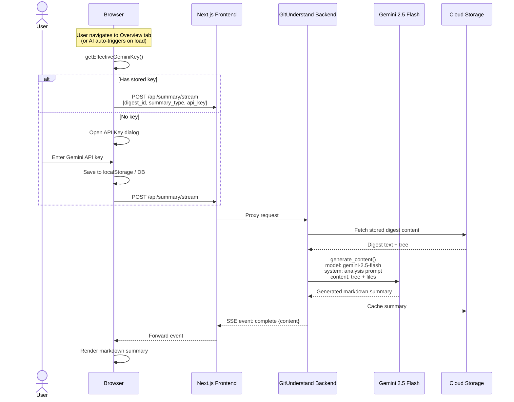

### Flow 3: Diagram Generation

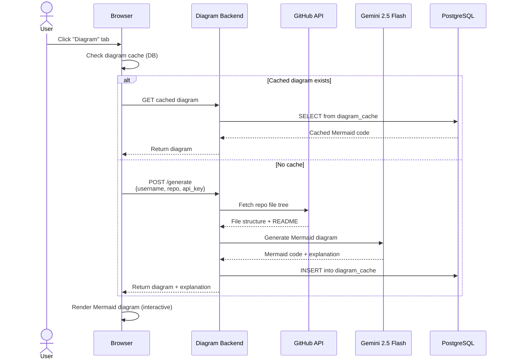

### Flow 4: AI Chat

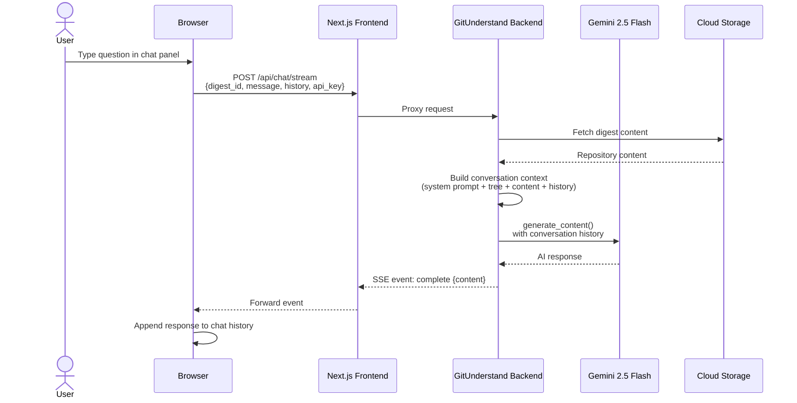

---

## Data Model

### PostgreSQL Database (Cloud SQL)

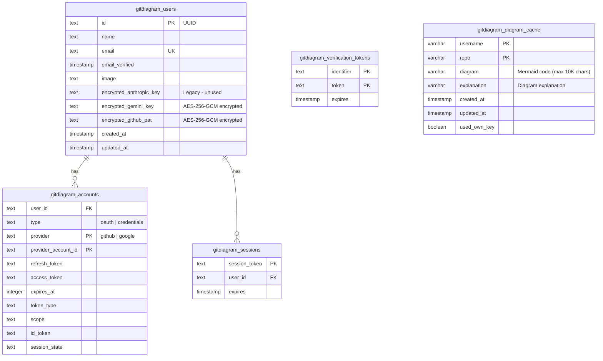

### GCS Storage Structure

```
gs://gitunderstand-digests/
  digests/
    {digest_id}/
      digest.txt          # Full repository text content
      metadata.json        # Repo metadata (name, files, tokens)
      summary_architecture.txt   # Cached AI summaries
      summary_security.txt
      summary_onboarding.txt
      summary_code_review.txt
```

---

## Storage Architecture

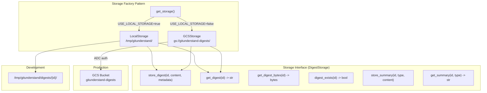

---

## Authentication & Security

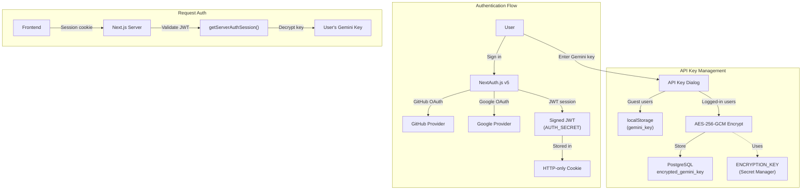

### Security Measures

| Layer | Mechanism |
|-------|-----------|
| API Rate Limiting | `slowapi` - 10/min (ingest), 15/min (chat) |
| CORS | Restricted to `gitunderstand.com`, `www.gitunderstand.com`, `localhost:3000` |
| Path Traversal | Symlink validation in ingestion engine |
| Secrets | GCP Secret Manager (8 secrets) injected at runtime |
| API Keys | AES-256-GCM encryption at rest in PostgreSQL |
| Auth | NextAuth.js v5 with JWT sessions |
| Containers | Non-root user (`appuser` / `nextjs`) |

---

## AI Integration (BYOK)

GitUnderstand uses a **Bring Your Own Key (BYOK)** model. Users provide their own Google Gemini API key - no server-side AI key is required.

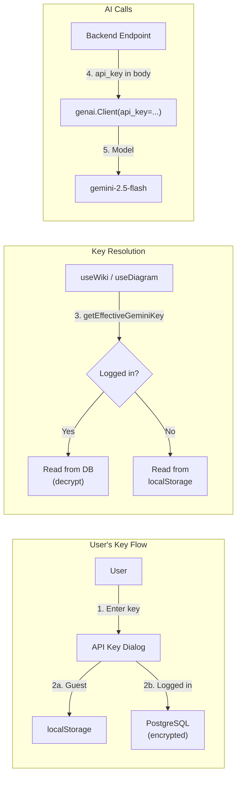

**Key Details:**
- **Model:** `gemini-2.5-flash` (fast, cost-effective)
- **SDK:** `google-genai` >= 1.0.0
- **Max content:** 400K chars for summaries, 200K chars for chat
- **Retry logic:** 3 retries with exponential backoff for rate limits
- **Key validation:** Gemini keys start with `AIzaSy...`

---

## GCP Infrastructure

### Resource Map

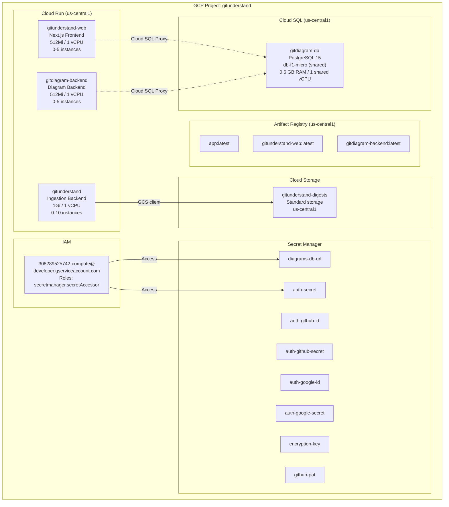

### Infrastructure Bill of Materials

| Service | Resource | Spec | Always-on Cost |
|---------|----------|------|----------------|
| Cloud Run | `gitunderstand-web` | 512Mi, 1 vCPU, 0-5 instances | $0 (scales to zero) |
| Cloud Run | `gitunderstand` | 1Gi, 1 vCPU, 0-10 instances | $0 (scales to zero) |
| Cloud Run | `gitdiagram-backend` | 512Mi, 1 vCPU, 0-5 instances | $0 (scales to zero) |
| Cloud SQL | `gitdiagram-db` | db-f1-micro, PostgreSQL 15 | ~$7.67/month |
| Cloud Storage | `gitunderstand-digests` | Standard, us-central1 | ~$0.02/GB/month |
| Artifact Registry | 3 Docker images | ~500MB each | ~$0.15/month |
| Secret Manager | 8 secrets | 10K access ops/month | ~$0.03/month |
| **Total baseline** | | | **~$7.87/month** |

---

## Deployment Pipeline

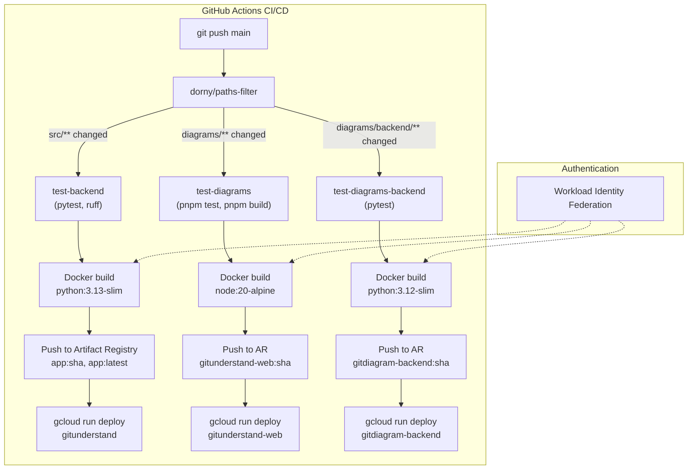

---

## Cost Estimates

### Pricing Assumptions (GCP us-central1)

| Resource | Unit Price | Free Tier |
|----------|-----------|-----------|
| Cloud Run vCPU | $0.00002400/vCPU-second | 180,000 vCPU-seconds/month |
| Cloud Run Memory | $0.00000250/GiB-second | 360,000 GiB-seconds/month |
| Cloud Run Requests | $0.40/million | 2 million requests/month |
| Cloud SQL db-f1-micro | $7.67/month (shared-core) | None |
| Cloud SQL Storage | $0.17/GB/month (SSD) | None |
| Cloud Storage | $0.020/GB/month | 5 GB free |
| Cloud Storage Ops | $0.005/1K Class A, $0.004/10K Class B | 5K/50K free |
| Artifact Registry | $0.10/GB/month | 0.5 GB free |
| Network Egress | $0.12/GB (after 1 GB free) | 1 GB free |
| Secret Manager | $0.06/10K access ops | 6 active versions free |

### Usage Model Per User Session

A typical user session (submit repo, view results, generate 2 AI summaries, view diagram):

| Action | Duration | vCPU-sec | Memory (GiB-sec) | Requests |
|--------|----------|----------|-------------------|----------|
| Page load (Next.js) | 2s | 2 | 1 | 3 |
| Ingest stream (clone + analyze) | 15s | 15 | 15 | 1 |
| AI summary x2 (pass-through) | 5s each | 10 | 10 | 2 |
| Diagram generation | 8s | 8 | 4 | 1 |
| Chat message x3 | 3s each | 9 | 9 | 3 |
| Static assets / API calls | - | 0 | 0 | 10 |
| **Total per session** | | **44** | **39** | **20** |

> **Note:** AI costs (Gemini API) are paid by the user via their own API key. Gemini 2.5 Flash costs ~$0.15/1M input tokens and ~$0.60/1M output tokens. A typical summary costs the user ~$0.01-0.05.

### Cost Breakdown by Scale

#### 1,000 Monthly Active Users (~3,000 sessions/month)

| Component | Calculation | Monthly Cost |
|-----------|-------------|--------------|
| **Cloud Run Compute** | | |
| vCPU | 3,000 x 44 = 132,000 sec (under free tier of 180K) | **$0.00** |
| Memory | 3,000 x 39 = 117,000 GiB-sec (under free tier of 360K) | **$0.00** |
| Requests | 3,000 x 20 = 60,000 (under free tier of 2M) | **$0.00** |
| **Cloud SQL** | db-f1-micro always-on | **$7.67** |
| Cloud SQL Storage | ~1 GB | **$0.17** |
| **Cloud Storage** | ~5 GB digests | **$0.10** |
| Storage Ops | ~30K operations | **~$0.02** |
| **Artifact Registry** | ~1.5 GB images | **$0.10** |
| **Network Egress** | ~3 GB | **$0.24** |
| **Secret Manager** | ~10K accesses | **~$0.06** |
| | | |
| **TOTAL** | | **~$8.36/month** |
| | | **~$100/year** |

> At 1,000 users, you are almost entirely within GCP free tier for Cloud Run. The main cost is Cloud SQL.

#### 10,000 Monthly Active Users (~30,000 sessions/month)

| Component | Calculation | Monthly Cost |
|-----------|-------------|--------------|
| **Cloud Run Compute** | | |
| vCPU | 30K x 44 = 1,320,000 sec - 180K free = 1,140,000 x $0.000024 | **$27.36** |
| Memory | 30K x 39 = 1,170,000 GiB-sec - 360K free = 810,000 x $0.0000025 | **$2.03** |
| Requests | 30K x 20 = 600,000 (under free tier of 2M) | **$0.00** |
| **Cloud SQL** | db-f1-micro (might need upgrade to db-g1-small at $25.55/mo) | **$25.55** |
| Cloud SQL Storage | ~10 GB | **$1.70** |
| **Cloud Storage** | ~50 GB digests | **$1.00** |
| Storage Ops | ~300K operations | **~$0.20** |
| **Artifact Registry** | ~1.5 GB | **$0.10** |
| **Network Egress** | ~30 GB | **$3.48** |
| **Secret Manager** | ~100K accesses | **~$0.60** |
| | | |
| **TOTAL** | | **~$62/month** |
| | | **~$744/year** |

> At 10,000 users, Cloud Run compute becomes the second largest cost. Consider upgrading Cloud SQL to `db-g1-small` for better connection handling.

#### 1,000,000 Monthly Active Users (~3,000,000 sessions/month)

| Component | Calculation | Monthly Cost |
|-----------|-------------|--------------|
| **Cloud Run Compute** | | |
| vCPU | 3M x 44 = 132M sec - 180K free ~= 132M x $0.000024 | **$3,168** |
| Memory | 3M x 39 = 117M GiB-sec - 360K free ~= 117M x $0.0000025 | **$293** |
| Requests | 3M x 20 = 60M - 2M free = 58M x $0.40/M | **$23.20** |
| **Cloud SQL** | Need db-custom-4-16384 or higher | **$350-500** |
| Cloud SQL Storage | ~1 TB | **$170** |
| Cloud SQL HA (recommended) | Regional HA doubles cost | **$350-500** |
| **Cloud Storage** | ~5 TB digests | **$100** |
| Storage Ops | ~30M operations | **~$20** |
| **Artifact Registry** | ~1.5 GB | **$0.10** |
| **Network Egress** | ~3 TB | **$360** |
| **Secret Manager** | ~10M accesses | **~$60** |
| **Cloud CDN (recommended)** | Cache static assets | **~$100** |
| **Cloud Armor (recommended)** | DDoS protection | **$200** |
| | | |
| **TOTAL** | | **~$5,200-5,700/month** |
| | | **~$62,000-68,000/year** |

> At 1M users, you need significant infrastructure upgrades: larger Cloud SQL, Cloud CDN for caching, Cloud Armor for DDoS protection, and possibly Cloud Memorystore (Redis) for caching digests.

### Cost Comparison Chart

```
Monthly Cost by Scale
=====================

1K Users     $8    |##
10K Users    $62   |################
1M Users     $5,500|#################################################################
                    $0       $1,000      $2,000      $3,000      $4,000      $5,000

Cost per User per Month
=======================

1K Users     $0.008 |########
10K Users    $0.006 |######
1M Users     $0.006 |######
```

### Scaling Recommendations by Tier

| Scale | Cloud SQL | Cloud Run | Additional Services |
|-------|-----------|-----------|-------------------|
| **< 1K** | db-f1-micro ($7.67) | Default config | None needed |
| **1K-10K** | db-g1-small ($25.55) | Increase max instances to 10-20 | Consider Cloud CDN |
| **10K-100K** | db-custom-2-8192 (~$130) | max instances 20-50, min 1-2 | Cloud CDN + Redis |
| **100K-1M** | db-custom-4-16384 (~$400, HA) | max instances 50-100, min 2-5 | CDN + Redis + Cloud Armor |
| **> 1M** | db-custom-8-32768 (HA + read replicas) | max instances 100+, min 5+ | Full production stack |

### Cost Optimization Tips

1. **Cloud Run min-instances = 0**: Saves money during low-traffic hours (currently configured)
2. **BYOK model eliminates AI costs**: Users pay for their own Gemini API usage
3. **GCS digest caching**: Summaries are cached - repeat views don't trigger AI calls
4. **Diagram caching in PostgreSQL**: Diagrams are cached per repo - no repeated Gemini calls
5. **Cloud SQL auto-storage-increase**: Prevents over-provisioning storage
6. **GitHub Actions CI/CD**: Free for public repos (2,000 min/month for private)
7. **Consider Cloud CDN**: At 10K+ users, caching static Next.js assets saves compute costs
8. **Consider Committed Use Discounts**: At 100K+ users, 1-year or 3-year commitments save 17-52%

---

## Appendix: Environment Variables

### Frontend (gitunderstand-web)

| Variable | Source | Description |
|----------|--------|-------------|
| `GITUNDERSTAND_API_URL` | Build-time ARG | URL of ingestion backend |
| `NEXT_PUBLIC_API_DEV_URL` | Build-time ARG | URL of diagram backend |
| `POSTGRES_URL` | Secret Manager | Cloud SQL connection string |
| `AUTH_SECRET` | Secret Manager | NextAuth JWT signing key |
| `AUTH_GITHUB_ID` | Secret Manager | GitHub OAuth Client ID |
| `AUTH_GITHUB_SECRET` | Secret Manager | GitHub OAuth Client Secret |
| `AUTH_GOOGLE_ID` | Secret Manager | Google OAuth Client ID |
| `AUTH_GOOGLE_SECRET` | Secret Manager | Google OAuth Client Secret |
| `ENCRYPTION_KEY` | Secret Manager | AES-256-GCM key for API keys |
| `AUTH_TRUST_HOST` | Env var | `true` for Cloud Run |
| `AUTH_URL` | Env var | `https://gitunderstand.com` |

### Ingestion Backend (gitunderstand)

| Variable | Source | Description |
|----------|--------|-------------|
| `GCP_PROJECT_ID` | Env var | `gitunderstand` |
| `USE_LOCAL_STORAGE` | Env var | `false` (use GCS) |
| `GCS_BUCKET_NAME` | Env var | `gitunderstand-digests` |
| `ALLOWED_HOSTS` | Env var | Comma-separated allowed hosts |

### Diagram Backend (gitdiagram-backend)

| Variable | Source | Description |
|----------|--------|-------------|
| `GITHUB_PAT` | Secret Manager | GitHub PAT for API access |
| `ENVIRONMENT` | Env var | `production` |
| `ALLOWED_ORIGINS` | Env var | CORS allowed origins |
